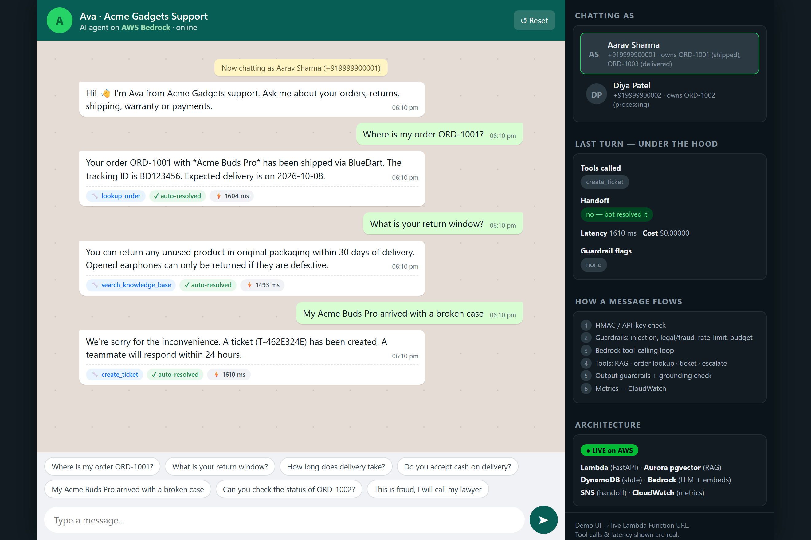

# WhatsApp AI Support Agent on AWS

A production-style **AI customer-support agent** for WhatsApp — RAG + tool-calling on Amazon Bedrock — with the **reliability layer** around it: evaluations, observability, guardrails, retries and cost controls.

### 🔗 [**Live demo →**](https://d2ewzgrn6pydo.cloudfront.net) &nbsp;·&nbsp; no login required, works on mobile

> The demo is a WhatsApp-style chat talking to the **real deployed agent** on AWS. The right-hand panel shows the **actual tool calls, handoff decisions, latency and cost** for every message.



---

## What it does

A customer messages the store ("Acme Gadgets") and the agent "Ava":
- **Answers policy questions** (returns, shipping, warranty, payments) via **RAG** over a knowledge base — and answers *only* from retrieved docs.
- **Looks up orders** (status, carrier, tracking, ETA) — scoped to the customer's own phone number.
- **Opens support tickets** for damaged/missing/wrong items.
- **Hands off to a human** when it should — and then stays silent on that thread.

It's deliberately **two projects in one**:
1. **The agent** — webhook → guardrails → Bedrock tool-calling loop → RAG → reply.
2. **The reliability layer** — golden-set evals with an LLM judge + CI regression gate, CloudWatch metrics/dashboard/alarms, retries with model fallback, per-customer rate limits and a daily spend cap.

## Architecture

```
WhatsApp Cloud API ──► Lambda Function URL ──► FastAPI (Mangum)
                          (HMAC-verified)         │
                             dedupe ─ mute-if-human ─ input guardrails ─ rate limit ─ budget cap
                                                    │
                                     Bedrock Converse tool loop  (retries → model fallback → human)
                          ┌───────────────┬────────┴───────┬──────────────────┐
                  search_knowledge_base  lookup_order   create_ticket   escalate_to_human
                  Titan embeddings →     DynamoDB       DynamoDB        DynamoDB ticket + SNS email
                  pgvector (Aurora       (owner-checked)
                  Serverless v2, Data API)
                                                    │
                                   output guardrails ─ grounding check ─ reply
                                                    │
                              JSON logs + EMF metrics ─► CloudWatch dashboard + alarms

Public demo:  CloudFront ──► S3 (chat UI)  +  /chat,/reset proxied to Lambda (x-api-key injected at the edge)
```

## Design choices worth talking about
- **Tool loop** (`app/agent.py`): max 5 iterations; malformed or runaway loops hand off to a human instead of spinning. Tool errors return structured JSON to the model rather than raising.
- **RAG as a tool, not a pre-step**: the model decides when to retrieve, so "hi" costs no embedding call. Chunking (`app/rag.py`): split on markdown headings, pack to ~900 chars with 120-char overlap, and prefix every chunk with its heading path so "30 days" still matches "return window". Cosine top-4 with a similarity floor (`RETRIEVAL_MIN_SCORE`) — below it the tool returns `confidence: low` and the agent refuses to guess.
- **Guardrails live outside the LLM** (`app/guardrails.py`), so a clever prompt can't disable them: injection block, legal/fraud keyword handoff, order-ownership check (a customer can only see orders tied to their own number), card-number redaction, system-prompt-leak block, and a numeric grounding heuristic that flags numbers absent from any tool output.
- **Handoff triggers**: model escalates; sensitive keywords; 2 consecutive low-confidence retrievals; tool-loop overrun; LLM outage; daily budget exhausted. After handoff the bot goes silent on that thread.
- **Reliability**: jittered exponential backoff on throttling/timeouts, then automatic fallback to a second model, then graceful human handoff. Webhook is idempotent (Meta retries). Per-customer rate limit and a global daily USD cap, both in DynamoDB so they hold across Lambda containers.
- **Aurora Data API** means the Lambda needs no VPC/NAT/connection pooling. Aurora min capacity is 0 (auto-pause), so idle cost is ~zero.
- **MCP**: `mcp_server/order_server.py` exposes `lookup_order` and `create_ticket` over MCP (stdio), reusing the same store.
- **Edge-injected API key**: the public demo serves the UI and proxies the API through CloudFront, which adds the `x-api-key` header at the edge — the key never reaches the browser, and UI + API are same-origin (no CORS).

## Tech stack
**Python / FastAPI** · **AWS Lambda** (arm64) · **Amazon Bedrock** (Converse API + Titan embeddings) · **Aurora Serverless v2 + pgvector** · **DynamoDB** · **SNS** · **CloudWatch** · **S3 + CloudFront** · **Terraform** · **GitHub Actions** · **MCP**

## Repo layout
```
app/            FastAPI app: webhook, agent loop, tools, RAG, guardrails, store, observability
mcp_server/     MCP server exposing the order tools
evals/          golden set + LLM-judge harness + regression baseline
kb/             knowledge-base markdown (returns, shipping, warranty, payments)
scripts/        build, seed demo orders, ingest KB into pgvector
terraform/      all infrastructure (agent + demo hosting)
demo/           the chat UI (served from S3 via CloudFront)
tests/          unit tests (run with a stubbed model, no AWS needed)
.github/        CI: unit tests + terraform validate on every PR; evals via OIDC
```

## Run locally (no AWS infra needed)
```bash
pip install -r requirements-dev.txt
pytest -q                                   # 20 tests, no AWS needed
STORE_BACKEND=memory VECTOR_BACKEND=memory python -m evals.run_evals --judge   # needs Bedrock creds
STORE_BACKEND=memory python -m mcp_server.order_server                          # MCP server
```

## Deploy to AWS
Prereqs: AWS creds, Terraform ≥ 1.6, Python 3.12, and Bedrock model access (a Claude or Amazon Nova chat model + Titan Text Embeddings V2).
```bash
./scripts/build_lambda.sh
cd terraform && terraform init && terraform apply -var alert_email=you@example.com
# seed demo data, then demo via the /chat endpoint (see terraform outputs)
```
The webhook plugs into **Meta for Developers → WhatsApp**; without a WhatsApp Business number you can demo everything through `/chat`.

## Evals & CI
`evals/golden.jsonl` has 12 cases (policy, orders, Hinglish, wrong-owner order, damaged item, unknown topic, legal threat, prompt injection). Each is scored on deterministic checks (tools used/forbidden, handoff, required/forbidden text) **plus an LLM judge** (groundedness / helpfulness / tone). The build fails if pass-rate, judge score or cost-per-case regresses vs `evals/baseline.json`. CI runs unit tests + `terraform validate` on every PR; evals run against Bedrock via GitHub OIDC (no stored keys).

## Notes
- Model is pluggable via Terraform (`-var primary_model=…`); it runs on any Bedrock chat model that supports the Converse API + tool use (Claude or Amazon Nova).
- Orders/tickets are demo DynamoDB items, not a real OMS integration.
- The webhook processes synchronously; for production volume put SQS between the webhook and a worker Lambda.
